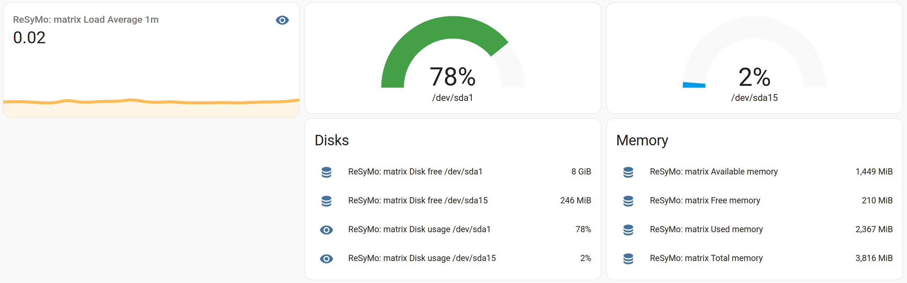
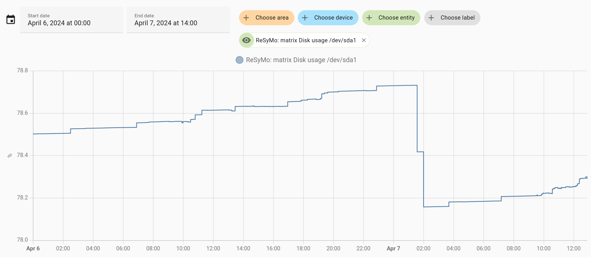
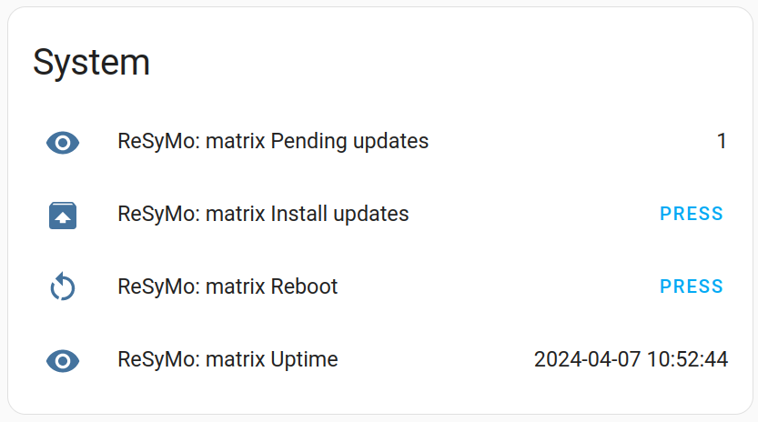

If you're a technically interested person like me, you might have a few servers and Raspberry Pis that you're running.
However, do you know which one is running out of disk space? Sure, you can `ssh` into them. But having a
[Home Assistant](https://www.home-assistant.io/) instance anyway, couldn't life be a bit better?

Here's my scratch to that itch: [ReSyMo](https://github.com/ctron/resymo).

<!-- more -->

## What's the deal?

The situation is quite simple. I have a bunch of machines. Cloud-based VMs as well as Raspberry Pis sitting on desks (at best). And every now and then something goes boom. Running out of disk space, forgot to apply updates for a while. You
might know what I mean.

I've been looking for a simple solution for this for quite a while. Yes, there's [Nagios](https://www.nagios.org/)
(tried that) and a few others. However, most of them tend to bring in a complexity that's overwhelming for such a
small use case. In the end, I don't want to run a lot of infrastructure for a handful of machines.

Even when working on [Eclipse NeoSCADA](https://projects.eclipse.org/projects/iot.eclipsescada), which would have been
easily capable of covering that use case, the complexity it brought in wasn't worth the effort.

So I ignored that problem and for a few more years. Life went on with `ssh` until, once more, some disk ran full.

## Back to the drawing board!

So, what did I actually need? Or want. That's actually quite easy:

* I want to be able to continuously monitor a small set of machines. Inside my home network, as well as on the public
  internet.
* The installation should be as simple as possible. Install some kind of "agent", bring some small config file,
 start it up with `systemd`.
* I want to some dashboard-style visualization. Ideally with some time series database attached.
* Alerting would be nice. But having a simple dashboard would be sufficient for me.

Turns out, I actually already have all of that: my local Home Assistant setup.

## What's missing?

There are multiple ways to get data into Home Assistant. And there are even a few integrations which scrape system
information and provide it to Home Assistant. However, again, all of them lack some kind of feature. Either it's
only for the local machine Home Assistant is running on. Or it requires some complex installation. Or it needs direct
network access to Home Assistant.

The latter is maybe just my personal problem. As I wanted to re-use my existing Home Assistant instance, which is in
my local network. I didn't want to expose that to the public internet. So how could machines that are not in my local
network report their status?

## MQTT to the rescue!

That's exactly where an MQTT broker can help. You run that broker on some public node. Point all providers of data,
event the internal ones, to that broker. Home Assistant can then connect to that broker too, and get all information.
And Home Assistant has a great [MQTT integration](https://www.home-assistant.io/integrations/mqtt/),
including auto-discovery of devices.

A little bit of Rust coding later, there's some support for connecting to Home Assistant via an MQTT broker:
<https://github.com/ctron/homeassistant-agent/> It's actually just a thin layer on top of MQTT, but helps a bit
with the data structures that Home Assistant requires for the auto-discovery.

## ReSyMo: Remote System Monitoring

Having that Home Assistant MQTT agent functionality, it is easy to use Rust to scrape some system data and report that
via MQTT to Home Assistant: <https://github.com/ctron/resymo>

Having a working MQTT setup, the steps are as simple as:

* Create a config file like:
  ```yaml
  $schema: "https://raw.githubusercontent.com/ctron/resymo/main/deploy/config/schema.json"
  uplinks:
    homeassistant:
      connector:
        host: <mqtt broker host>
        username: <username>
        password: <password>
  ```
* Run the `resymo-agent` on the machine to monitor

Yes, that's it! And with that, you can get some nice dashboard like:



You also have a time series database for values:



## But wait …

Home Assistant cannot only monitor devices, but also control them. And while having basic system information is great,
sometimes you want more. One important information I wanted to have was the information of how many system updates are
pending. And ideally a single button to trigger the update.

Instead of directly coding an update process into the resymo agent (which would be different between distributions), I
simply added the ability to extract information from running a process and triggering a process via an MQTT command.

Here's an example configuration for proving the number of updates and triggering an update process:

```yaml
collectors:
  exec:
    items:

      pending_updates:
        period: 1h
        command: bash
        args:
          - -c
          - |
            apt update &> /dev/null;
            apt list --upgradable -qq | wc -l
        discovery:
          - name: Pending updates
            state_class: measurement
            value_template: '{{ '{{ value_json.stdout }}' }}'

commands:
  exec:
    items:

      update:
        command: bash
        args:
          - -c
          - |
            apt dist-upgrade --yes
        envs:
          DEBIAN_FRONTEND: noninteractive
          NEEDRESTART_MODE: a
        discovery:
          name: Install updates
          device_class: update
```

Which allows you to create the following Home Assistant dashboard (minus the reboot and uptime entity, that's a different
configuration):



## Rolling it out

Having that configuration, one might ask, if this is indeed simpler than something like Nagios. I think it is. Simply
because the focus on the actual data and commands. Still, the question is, how to roll it out to a handful of servers
in an efficient way?

This is where I turned to [Ansible](https://www.ansible.com/). Ansible does a great job in reaching out to a bunch of
machines, tweaking some configuration. It would be too much for this blog post to go into more details here. But
creating a configuration file, fetching that binary, and setting up a systemd unit is no big deal for Ansible. It also
is possible to use Ansible's Jinja2 templating integration to conditionally create sections in the configuration for
different operating systems.

## What's next?

Works for me 😉! I've been using this for a few weeks now. And it works like a charm. Even on a mobile phone, thanks to
the Home Assistant app. There's a bunch of additional data that would be useful, like network traffic, for example. And
there could be some quality-of-life improvements, like triggering a value refresh after finishing a command.

For you? Maybe give it a try? If you're missing some features, create an issue and let me know.

Maybe also peek at the repository of the underlying [homeassistant-agent](https://github.com/ctron/homeassistant-agent/).
ReSyMo is just one application built on top of it. If you want to create your own device capable of using
Home Assistant's MQTT integration in Rust, that might a something for you to try out.

## Links

* [ctron/resymo](https://github.com/ctron/resymo) – The ReSyMo agent
* [ctron/homeassistant-agent](https://github.com/ctron/homeassistant-agent/) – The crate allowing to build Home Assistant integrations using MQTT
* [Home Assistant MQTT integration](https://www.home-assistant.io/integrations/mqtt/)
