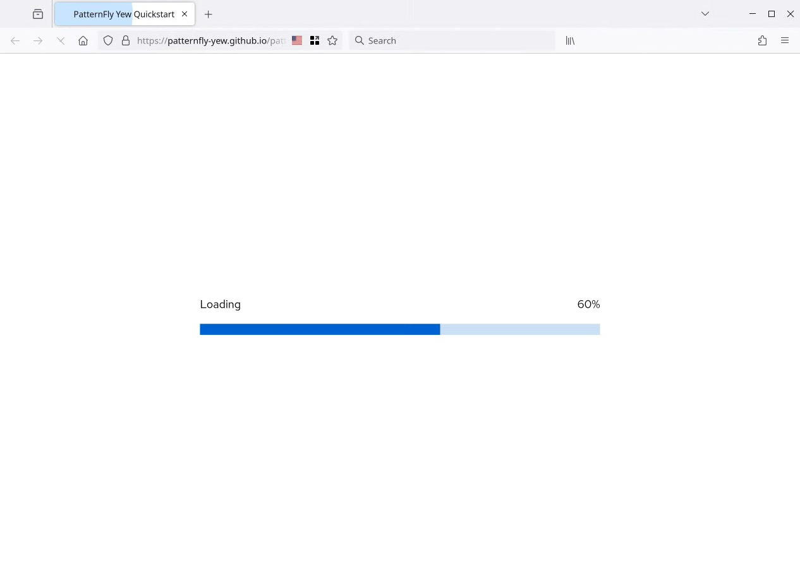

In version 0.19.x Trunk gained an ["initializer" framework](https://trunkrs.dev/guide/advanced/initializer.html),
which can be used to hook in code into the process of loading and initializing the WebAssembly application. This blog
post shows how this can be used to create a visual progress meter for the loading process.

<!-- more -->

## Frontends, applications, and BLOBs

WebAssembly applications, just like their JavaScript-based counterparts, require an initial download of the application.
You might wonder why JavaScript requires that? And yes, there are two main ways to consume JavaScript in the browser.
The first is the original one, you have a web page, and add a bit of scripting, using Java*Script*. That loads all kinds
of assets, like images, CSS, and well, JavaScript files. You can even embed that code in the HTML file.

Bigger JavaScript frontend *application* work differently though. You have a "compilation" process, which transforms
JavaScript (or TypeScript) into a different form of JavaScript. Most likely, you're using a "bundler", like `webpack`.
That collects all JavaScript dependencies, runs a few tools on the code, and packs everything together in bigger
packages, which need to be loaded when you open the web page.

And to be honest, such applications, running in the frontend, are exactly that: applications. You download code and
run it in the browser. Leveraging the browser's graphical capabilities and APIs to interact with the user.

WebAssembly is no different here. With the exception that the code comes pre-compiled, optimized, and can be written
in any programming language you prefer.

But to start the application, you point your browser to a web page, which downloads the "executable" and runs it.

## Trunk & bundling

If you already know Trunk, you can this skip section. If not, you want to take a look
at [The Guide](https://trunkrs.dev/guide/) to learn more.

In a nutshell, Trunk orchestrates the build of the WebAssembly application, including things like SCSS and minification.
It then collects and bundles the assets, modifying your `index.html` to load and initialize the application. The actual
process of loading happens via some JavaScript snippets, which are generated by
[`wasm_bindgen`](https://rustwasm.github.io/wasm-bindgen/).

"JavaScript?", you might ask. Yes, because it's a great language for doing a little bit of scripting in the browser. And
in a simple, default setting, you don't even know it is there. Trunk does it all for you, run the tools, collect the
output, and give you a ready-to-serve output folder.

## The initializing process

When you load up the `inedx.html`, that will trigger the initialization of the WebAssembly asset. Loading the BLOB using
the Fetch API, setting up a [WebAssembly](https://developer.mozilla.org/en-US/docs/WebAssembly) instance, and start it.

Depending on the complexity and size of your application, that might take a bit. Running WebAssembly is quite fast, but
the process of loading it can take a bit and might be noticeable by the user.

And during that whole process, something might go wrong, so the defaults might not be good enough.

## Tapping into the process

Of course, everyone has a different opinion on how to handle things. That is why Trunk doesn't force you to any specific
approach, but gives you options.

To tap into the process, you will need to tell Trunk where it can find your code. That's done using the
`data-initializer` attribute on the application's `<link>` element:

```html
<link data-trunk data-initializer="src/initializer.mjs" rel="rust" [...] />
```

This points Trunk to the file `src/initializer.mjs`, and as you can see by the extension, it needs to be a [JavaScript
module](https://developer.mozilla.org/en-US/docs/Web/JavaScript/Guide/Modules). This file is expected to default export
a function, which creates the initializer:

```javascript
export default function myInitializer () {
  return {
    // called when the initialization starts 
    onStart: () => {},
    // called when the download progresses, including a last update at the ennd
    onProgress: ({current, total}) => {},
    // called when the process is complete (succesful or not) 
    onComplete: () => {},
    // called when the process has completed successfully, including the WebAssembly instance
    onSuccess: (wasm) => {},
    // called when the process failed, including the error 
    onFailure: (error) => {}
  }
};
```

## Progress!

That gives us all we need to create some progress visualization during the loading process of the application:

```javascript
export default function myInitializer () {
  return {
    // called when the initialization starts 
    onStart: () => {
        showProgress();
    },
    // called when the download progresses, including a last update at the ennd
    onProgress: ({current, total}) => {
        updateProgress(Math.round((current / total) * 100));
    },
    // called when the process is complete (succesful or not) 
    onComplete: () => {},
    // called when the process has completed successfully, including the WebAssembly instance
    onSuccess: (wasm) => {
        updateState("Complete");
    },
    // called when the process failed, including the error 
    onFailure: (error) => {
        updateState("Failed", error);
    }
  }
};
```

I know, this just outlines the idea. For a fully working example, using PatternFly, you can check out this initializer:
<https://github.com/patternfly-yew/patternfly-yew-quickstart/blob/main/assets/initializer.mjs>

Which will like this during the loading process: 



## What's next? 

I would recommend checking out the documentation and examples we have. They should point you in the right direction.
And if they don't: PRs welcome 😉

* [Application Initializer](https://trunkrs.dev/guide/advanced/initializer.html) in the guide
* Basic [initializer example](https://github.com/trunk-rs/trunk/tree/main/examples/initializer)
* [Initializer for the PatternFly Yew Quickstart](https://github.com/patternfly-yew/patternfly-yew-quickstart/blob/main/assets/initializer.mjs)

You can also reach out on [Discord](https://discord.gg/JEPdBujTDr) or
[start a discussion on GitHub](https://github.com/trunk-rs/trunk/discussions) if you need help. Or even better, share
what you created with it.
